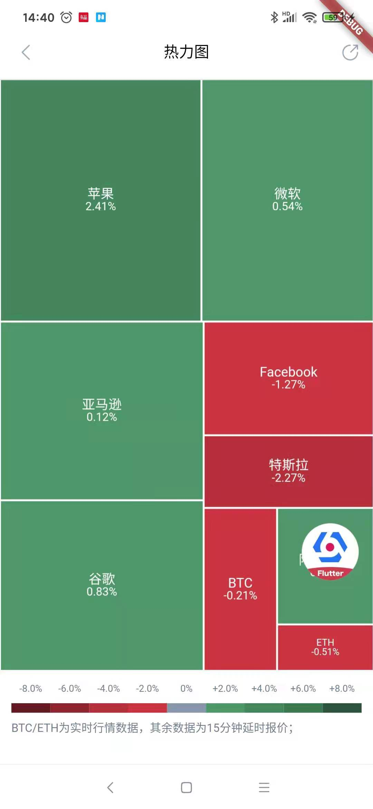

# lighthouse info

## 实现内容

* 基于`provider` 的mvvm模式做状态管理
* 组件化，组件化的路由管理，各个组件可单独运行
* 基于`dio` 的请求封装
* 基于`web_socket_channel` 的websocket封装，支持重连
* 用户、密码、验证码输入框封装
* 完整的登录逻辑
* 本地化
* 下拉刷新 + 上拉加载更多
* NestedScrollView + TabView联动
* 曲线图、饼状图、柱状图、热力图
* K线图、分时图
* 截图功能，长页面截图，webview截图
* 长文章页面
* 微信分享，保存本地图片分享
* 基于bugly的应用全量更新
* 基于bugly + tinker的热更新
* 基于walle的多渠道打包
* 代码迁移至nullsafety
* 全平台适配，Web、Android、iOS、Windows、macos

## 在线Demo
[http://www.jerryplay.top/lighthouse](http://www.jerryplay.top/lighthouse)

备注：部分三方库不支持Web、Desktop平台，如微信、bugly、webview等，因此Web、Desktop端相关功能暂时缺失

## 截图

|     |      |    |
| :--------------------------------: | :---------------------------------: | :-------------------------------: |
|     |      |    |
|     |      |
## 使用的三方库

| 库                         | 功能             |
| -------------------------- | --------------- |
| [shared_preferences](https://github.com/flutter/plugins/tree/master/packages/shared_preferences)      | **SP**       |
| [date_format](https://github.com/tejainece/date_format)                            | **日期格式化**       |
| [event_bus](https://github.com/marcojakob/dart-event-bus)                            | **event_bus**       |
| [path_provider](https://github.com/flutter/plugins/tree/master/packages/path_provider)   | **本地存储路径**       |
| [package_info](https://github.com/flutter/plugins/tree/master/packages/package_info)     | **package信息**       |
| [permission_handler](https://github.com/Baseflow/flutter-permission-handler)      | **权限管理**       |
| [encrypt](https://github.com/leocavalcante/encrypt)                            | **加密库**       |
| [pull_to_refresh](https://github.com/peng8350/flutter_pulltorefresh)  | **下拉刷新上拉加载**       |
| [extended_nested_scroll_view](https://github.com/fluttercandies/extended_nested_scroll_view)    | **扩展NestedScrollView**       |
| [flutter_spinkit](https://github.com/jogboms/flutter_spinkit)                            | **loading动画**       |
| [decimal](https://github.com/a14n/dart-decimal)                            | **小数计算**       |
| [web_socket_channel](https://github.com/dart-lang/web_socket_channel)                            | **websocket插件**       |
| [dio](https://github.com/flutterchina/dio)                            | **网络库**       |
| [provider](https://github.com/rrousselGit/provider)                   | **状态管理**     |
| [cached_network_image](https://github.com/renefloor/flutter_cached_network_image)       | **图片加载**       |
| [fluro](https://github.com/theyakka/fluro)                            | **路由管理**     |
| [flutter_oktoast](https://github.com/OpenFlutter/flutter_oktoast)     | **Toast**        |
| [flutter_carousel_slider](https://github.com/serenader2014/flutter_carousel_slider)      | **Flutter 轮播组件**       |
| [url_launcher](https://github.com/flutter/plugins/tree/master/packages/url_launcher)   | **启动URL的插件**       |
| [image_picker](https://github.com/flutter/plugins/tree/master/packages/image_picker)   | **图片选择插件** |
| [image_cropper](https://github.com/hnvn/flutter_image_cropper)   | **图片裁剪** |
| [image_gallery_saver](https://github.com/hui-z/image_gallery_saver)   | **图片保存至相册** |
| [photo_view](https://github.com/fireslime/photo_view)   | **图片手势缩放（看大图）** |
| [flutter_inappwebview](https://github.com/pichillilorenzo/flutter_inappwebview)    | **更强大的webview插件**       |
| [webview_flutter](https://github.com/flutter/plugins/tree/master/packages/webview_flutter)    | **WebView插件**       |
| [keyboard_actions](https://github.com/diegoveloper/flutter_keyboard_actions)                  | **处理键盘事件**       |
| [sticky_headers](https://github.com/letsar/flutter_sticky_header)   | **列表悬浮头**       |
| [lpinyin](https://github.com/flutterchina/lpinyin)              | **汉字转拼音**   |
| [fl_chart](https://github.com/imaNNeoFighT/fl_chart)               | **图表库**       |
| [flutter_echarts](https://github.com/entronad/flutter_echarts)                   | **基于echart的图表库**   |
| [qr_flutter](https://github.com/apptreesoftware/flutter_barcode_reader)     | **二维码** |
| [intl](https://github.com/dart-lang/intl)     | **本地化** |
| [umeng_analytics_plugin](https://github.com/flmn/umeng_analytics_plugin)     | **友盟统计** |
| [bugly](https://github.com/crazecoder/flutter_bugly)     | **bugly** |
| [share](https://github.com/flutter/plugins/tree/master/packages/share)     | **分享插件** |
| [fluwx](https://github.com/OpenFlutter/fluwx)     | **微信SDK插件** |
| [flutter_xupdate](https://github.com/xuexiangjys/flutter_xupdate)     | **app更新** |
| [jpush_flutter](https://github.com/jpush/jpush-flutter-plugin)     | **极光推送** |
| [uni_links](https://github.com/avioli/uni_links/tree/master/uni_links)     | **uni_links** |

## 项目运行环境

    1. Flutter version 2.8.1
     
    2. Dart version 2.15.1

## 注意事项

* 渠道信息在 android\app\channel 文件中配置

* 多渠道打包，android工程下执行命令行 gradlew clean assembleReleaseChannels，文件生成在build\app\outputs\channels 目录

* 单独打某些渠道包，android工程下执行命令行 gradlew clean assembleReleaseChannels -PchannelList=official,google，文件生成在build\app\outputs\channels 目录

* 热更新开启时，使用 assembleReleaseChannels 命令也会打出基准包，文件生成在build\app\outputs\channels目录

* 测试环境包采用默认参数 -Ptarget=lib/main.dart，生产环境包设置参数 -Ptarget=lib/main_prod.dart

##  热更新注意事项

* tinker-support.gradle 中设置 enable = true，tinkerEnable = true

* 打基准包，android工程下执行gradle->app->Tasks->other->assembleRelease，文件生成在build\app\outputs\channels目录

* 打补丁包，将 build\app\outputs\channels 目录中的文件夹名称拷贝到 tinker-support.gradle 的 baseApkDir 中，执行gradle->app->Tasks->tinker-support->buildTinkerPatchRelease，补丁文件生成在build\app\outputs\patch目录